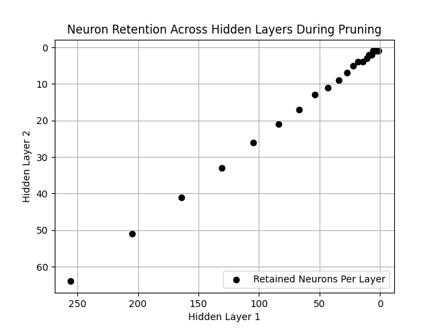
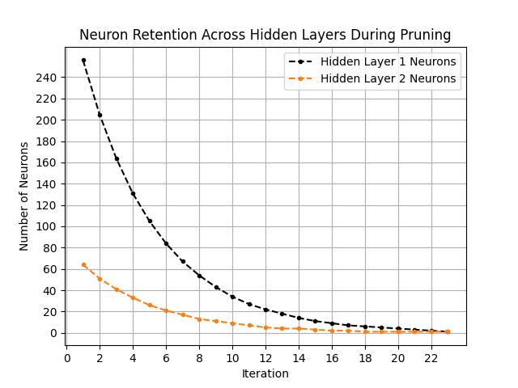
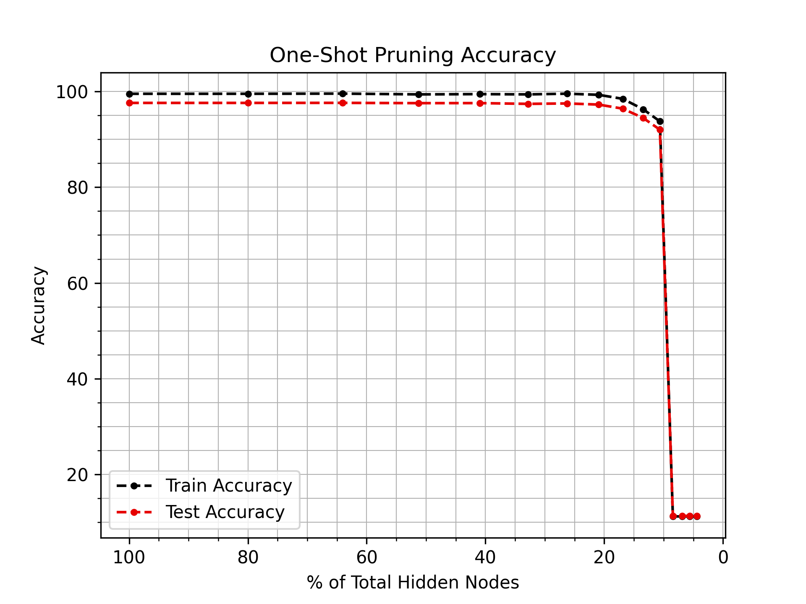
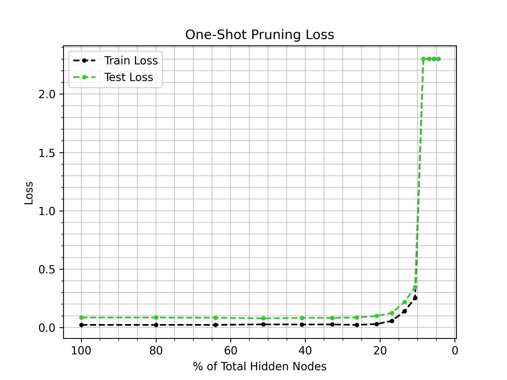

## Table of Contents
- [Prerequisite](#prerequisite)
- [Perform Iterative Pruning](#perform-iterative-pruning)
- [Model Deployment](#model-deployment)

### Introduction
The repository is part of the master's thesis, 'Interval-Adjoint Sensitivity Guided Neural Network Pruning'. The project aims to structurally prune a fully-connected neural network using interval-adjoint sensitivity information. Each iteration compute the significance of each neuron, removes a fraction of least significant neurons in each layer. and later retrain the model. Pruning continues unless the stopping criteria is met. Later, a pruned model, with suitable trade-off between complexity and efficiency, is selected for deployment.

[](https://pytorch.org/)
[](https://pytorch.org/vision/)
[](https://matplotlib.org/)
[](https://pypi.org/project/thop/)

### Prerequisite
  - [ ] Generate (any) problem directiory, `src/mnist/`, for mnist data classification.
  - [ ] Define datasets and dataloaders in the file `src/mnist/dataloaders.py`
  - [ ] Download data in the directory `src/mnist/data/`
  - [ ] Define neural network model in the file `src/mnist/model.py`
  - [ ] Generate neurons retention data from the file `src/mnist/retain.py`
      - [ ] Define initial number of neurons in each hidden layer as
            <br> ```self.h1, self.h2 = 256, 64 ```
      - [ ] Define maximum number of iteration
            <br> ```self.iterations = list(range(0,31))```
      - [ ] Add respective hidden neurons headers in ```self.headers```
      - [ ] Define the number of neurons to retain in each layer every iteration
            <br> ```t1 = round(self.h1 * (self.q) ** t) ```
            <br> ```N1 = t1 if t1 > 1 else 1 ```
      - [ ] Add the number of neurons retained in each hidden layer to
            <br>```per = (N1 + N2) / (self.h1+self.h2) * 100 ```
      - [ ] Append the number of neurons retained in each hiiden layer to
            <br>```self.data.append([t, N1, N2, per])```
      - [ ] To plot the neurons decay function, adjust functions ```plot_data_iterations()``` and ```plot_data_distribution()``` 
  - [ ] Ensure the generated direcotry `src/mnist/retain/` has the files
      - [ ] `retain.txt`
      - [ ] `pruneNodesIteration.png`
      - [ ] `pruneNodesDistribution`
  <div align="center">
    <table>
      <tr>
        <td align="center"><br>
            <div align="center"> <sub>pruneNodesDistribution.png</sub> </div> 
        </td>
        <td><br> 
            <div align="center"> <sub>pruneNodesIteration.png</sub> </div> 
        </td>
      </tr>
    </table>
  </div>

### Perform Iterative Pruning  
  - [ ] Locate `__name__=='__main__' in the file ```src/iterativeprune.py```
  - [ ] Define the neural network model
        <br> `model = SimpleNN()`
  - [ ] Generate pruning data that results in file `src/mnist/retain/retain.txt`
        <br> `data = GeneratePruneData().generate_data()`
  - [ ] Initialze the iterative pruning with relevant arugments
        <br> `experiment = IterativePruning(train_loader, test_loader, train, evaluate)`
  - [ ] Define the directory to store experiment results
        <br> `my_dir = Path('mnist/sessions/2025-04-21/iterative_pruning/')`
  - [ ] Define the `begin_itr` variable
      - [ ] 0: start from scratch
      - [ ] ¬ 0 : start from given pruning iteration
  - [ ] Iterative pruning with retraining results in the directory structure.
        <pre> 
        mnist/sessions/2025-04-21/iterative_pruning/
        ├── 0/
        |   ├── prune_w_retrain/
        |   |    └── best_model.pth
        |   |    └── train_results.txt
        ├── 1/
        |   ├── prune_w_retrain/
        |   |    └── best_model.pth
        |   |    └── train_results.txt
        |   |    └── validation_results.txt
        |   ├── ...
        |   ...
        ...
        ├── ***i***/
        |   ├── prune_w_retrain/
        |   |     └── best_model.pth
        |   |     └── train_results.txt
        |   |     └── validation_results.txt
        </pre>
  - [ ] Once iterations halt, execute the file ```src/concatenate.py``` to generate
      - ```mnist/sessions/2025-04-21/iterative_pruning/prune_w_retrain_results/```
          - ```validations.txt```
          - ```accuracies.png```
          - ```losses.png```
  <div align="center">
    <table>
      <tr>
        <td align="center"><br>
            <div align="center"> <sub>accuracies.png</sub> </div> 
        </td>
        <td><br> 
            <div align="center"> <sub>losses.png</sub> </div> 
        </td>
      </tr>
    </table>
  </div>
  
  - [ ] Given the loss and accuracy graphs, copy the model path
        <br> ```src/mnist/sessions/2025-04-21/iterative_pruning/8/prune_w_retrain/best_model.pth```
  - [ ] Locate ```if __name__=='__main__'``` in the file ```src/validator.py```
  - [ ] Define the model
        <br> ```model = SimpleNN()```
  - [ ] Load pruned model
        <br> ```load_pruned_model(model, pruned_model_file)```
  - [ ] Define the model and paste the model file here to evaluate the pruned model on test data using
        <br> ```evaluate(model, train_loader, test_loader)```
  - [ ] Validate if the above results are same as those shown in graph. 

### Model Deployment
  - [ ]  Copy the pruned model file
        <br> ```src/mnist/sessions/2025-04-21/iterative_pruning/8/prune_w_retrain/best_model.pth```
  - [ ]  Copy the neural network model file:
        <br> ```src/mnist/model.py```
  - [ ]  Copy the model loader file
        <br> ```src/io.py```
  - [ ]  Execute the model in 3 steps below
      -  ```model = SimpleNN()```
      -  ```load_pruned_model(model, pruned_model_file)```
      -  ```model(input)```
